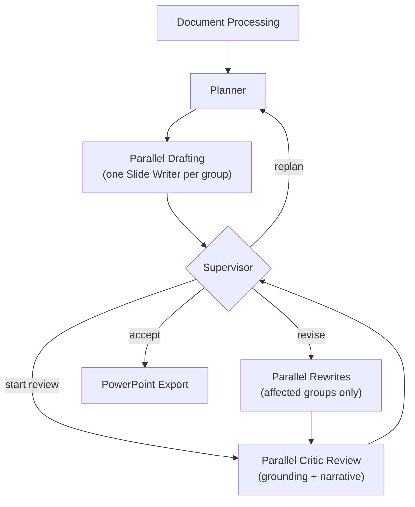

# Multi-Agent Research Synthesizer — Design Document

## Overview

A multi-agent research synthesis pipeline built on LangGraph. Given a user query and one or more source documents, the system produces a structured, insight-driven presentation through planning, parallel drafting, iterative review, targeted rewrites, optional replanning, and export. Four specialized agent roles — **Planner**, **Slide Writer**, **Critic**, and **Supervisor** — collaborate through a coordination checkpoint that handles fan-out and fan-in between decisions.

The key design philosophy: **each agent is stateless per call, but the session is stateful**. History, artifacts, and routing decisions are carried explicitly through LangGraph state and a persistent SQLite database, not implicitly through a shared context window.

---

## Graph Architecture

After planning, the run moves to a parallel drafting batch with one Slide Writer per slide group. All parallel work returns to a fan-in checkpoint before the Supervisor runs. The Supervisor decides whether to start review, dispatch targeted rewrites, accept the deck for export, or return to planning for a new deck structure. Each parallel batch completes before the next decision point.

---

## Review Phases

The session moves through review phases that determine what runs next:

| Phase | What happens |
|---|---|
| **Initial drafting** | One Slide Writer per slide group works in parallel to produce first drafts |
| **Awaiting supervisor** | The current batch has finished and the Supervisor decides the next route |
| **Critic dispatch** | Per-group grounding Critics and one deck-level narrative Critic run in parallel |
| **Rewrite dispatch** | Slide Writers run in parallel again only for affected groups or slides, using explicit rewrite instructions |
| **Complete** | The graph has accepted the deck for export or ended without export |

The default maximum is 4 critic/rewrite cycles, configurable at runtime. A session can attempt up to 2 full replans before it must either export an acceptable deck or end without export if critical issues remain.

---

## Agent Roles and Context Design

A deliberate principle throughout: **each agent receives only the context it needs to do its specific job**. This is enforced at the prompt construction level — all artifacts live in state and in the database, but each agent selectively loads its own context.

### Planner

The Planner is the presentation architect.

1. Loads all text chunks from the research database and detects section boundaries using Markdown heading analysis
2. Builds a human-readable section outline with stable labels (e.g. S0, S1, …) that the model reasons over — raw chunk identifiers never appear in the prompt
3. Calls the language model to produce a structured presentation plan: title, subtitle, thesis, target audience, narrative arc, per-slide blueprints (each with a narrative role and intent), and groupings (a few slides per group)
4. Validates the output strictly; retries the full model call (up to 2 times) if any section label is invalid, any group is out of range, or any blueprint is empty
5. Resolves section labels to concrete source chunks in code, then stores the resolved plan in state

When the run is replanned, the review loop is reset and the plan attempt advances. Prior review events and summaries remain available for audit and recurrence tracking, but the design should not assume they are automatically injected into the next planning prompt.

### Slide Writer

Each Slide Writer receives the blueprints and chunk text for its assigned group. Two modes exist:

- **Initial write:** synthesizes slides from scratch following the blueprint intent and narrative role
- **Rewrite:** receives the current proto-slides plus explicit rewrite instructions from the Supervisor and produces corrected versions

Both modes write structured proto-slide records to the research database and report write results back to state. Errors are caught and reported without crashing the graph; empty groups can be retried from the planning-to-drafting path as described above.

### Critic

Critics evaluate the current deck from two angles. Per-group Critics check **grounding consistency** — whether slide content is supported by the source material. A deck-level Critic checks **narrative coherence** — whether the full presentation flows according to the plan and audience intent. Each critic call is stateless by design.

Input: current proto-slides for the target slides, the relevant source material when grounding is being checked, and the slide plan for intent validation.

Output: a structured critic result with:

- A concise one- to two-sentence overview
- Whether any issue requires a fix
- A list of issues, each with severity (critical / major / minor), type, location, description, rewrite instruction, and affected slide numbers

Each issue is assigned a **fingerprint** — a short hash of scope, issue type, and location — which enables the Supervisor to detect recurring issues across cycles. Issues are persisted in the database for cross-cycle analysis.

### Supervisor

The Supervisor is the session’s decision-maker. It runs after each fan-in (when a full batch of parallel workers has reported back) and decides the next routing step.

**Decision logic:**

1. **No critic results for the current cycle** → start a new critic cycle (increment cycle count; if the cap is exceeded and rewrites were still pending, force replan)
2. **Rewrites ran in the current cycle** → dispatch a follow-up critic pass over the updated slides (post-rewrite verification)
3. **Fresh critic results, no pending rewrites** → call the language model with critic summaries, severity counts, and recurring fingerprints; the model returns accept, revise, or replan

**Guard overrides applied after the model decision:**

| Condition | Override |
|---|---|
| Model says accept but critical actionable issues exist | → revise |
| Model says accept but major actionable issues exist (not at cycle cap) | → revise |
| Model says accept but non-persistent actionable issues remain (not at cycle cap) | → revise |
| Model says revise but no actionable issues | → accept |
| Decision is revise but cycle count is at the maximum | → replan |

**Routing outcomes:**

- **accept** → mark the deck ready for export and end the graph
- **revise** → build targeted rewrite assignments from actionable critic issues, enter the rewrite phase, and fan out Slide Writers again — same parallel pattern as after planning, but driven by the Supervisor’s decision
- **replan** → return to the Planner with a fresh plan attempt after resetting the review loop

**Orchestration note:** Whenever the Supervisor chooses another parallel critic pass or a parallel rewrite pass, it is effectively ordering the next fan-out; workers merge back before the Supervisor runs again.

---

## Feedback Loop and History Design

The core challenge in a multi-node revision loop is that **each agent call is a fresh language model invocation with no implicit memory**. The Critic on cycle 3 has no knowledge that cycles 1 and 2 happened unless that information is explicitly injected.

Two mechanisms address this:

**1. Review events in the database**

Every issue raised by a Critic — and every accept or replan decision by the Supervisor — is persisted in the research database. The Supervisor loads the full event history for the current session at the start of each call, then counts how many times each fingerprint has appeared. That map allows the Supervisor to detect persistent issues and factor recurrence into its accept or revise decision. Issues that appear more than once across cycles are surfaced explicitly in the model prompt. Guards also use this history to allow acceptance when only stubborn minor issues remain after multiple revision attempts.

**2. Review summaries in state**

Each Supervisor call appends a compact cycle summary to state. This provides an ordered record of cycle decisions and issue counts for tracing, debugging, and future planning improvements.
