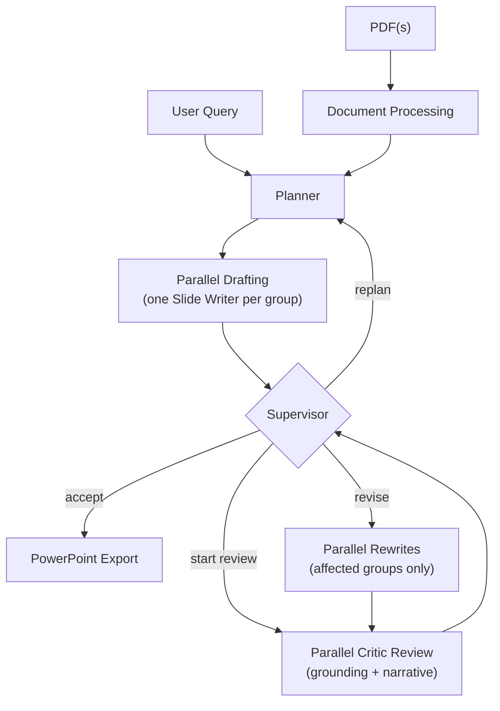

# Multi-Agent Research Presentation Synthesizer

By Vien Nguyen and Sheng Rao

LangGraph-coordinated pipeline that ingests one or more research PDFs and
produces a PowerPoint presentation through planning, parallel drafting, critic review,
targeted rewrites, and export. Parallel work always fans back into a coordination
checkpoint before the Supervisor decides whether to accept, revise, or replan.

## Project Documentation

> [!IMPORTANT]
> For a deep dive into the system architecture, database schemas, and design philosophy, please refer to the **[.design](.design/)** directory. This folder contains detailed markdown files covering the graph flow, document processing pipeline, and persistence layers.

## Setup

### 1. Python 3.11+

### 2. Virtual environment

```bash
python -m venv .venv
.venv\Scripts\activate          # Linux/Mac: source .venv/bin/activate   bash on Windows: source .venv/Scripts/activate
pip install -r requirements.txt
```

> Installing `sentence-transformers` and `sqlite-vec` can take longer because they bring specialized embedding and vector-search dependencies. The system uses **LlamaParse** by default for high-quality OCR, formula extraction, and chunking. `sqlite-vec` provides fast, local vector similarity search directly within SQLite.

### 3. API keys

Copy the sample and fill in your credentials:

```bash
copy .env.sample .env
```

See `.env.sample` for all supported keys (LLM providers, Langfuse, Cloudflare R2).

**Warning**: The provided config.sample.yaml file uses the free tier of 6 different LLM providers.  If you are using the provided config.sample.yaml file, you will need API keys for all 6 providers.

For LlamaParse, set **`LLAMA_CLOUD_API_KEY`** in your `.env`, else document processing will fail. You can get your API key from [LlamaParse](https://cloud.llamaindex.ai/).  Free tier signup gives you 10,000 credits, which is enough to process roughly 1000 pages of PDF.

### 4. Langfuse Logging (optional)

To enable observability, set these keys in your `.env`:

```env
LANGFUSE_SECRET_KEY="sk-lf-..."
LANGFUSE_PUBLIC_KEY="pk-lf-..."
LANGFUSE_BASE_URL="https://cloud.langfuse.com"
```

Disable with `--no-logging` as a commandline argument.

### 5. LLM providers and routing

Runtime LLM comes from a **LiteLLM Router** built from YAML. The app reads **`src/llm/config.dev.yaml`** at startup (see `init_from_config` in `src/llm/llm.py`).
If there is no `config.dev.yaml` file, the app will copy the sample config file to `config.dev.yaml`.

#### Create your local `config.dev.yaml`

`src/llm/config.dev.yaml` is local-only and ignored by git so each developer can keep personal provider/model settings per environment.

1. Copy the sample into your local config:

```bash
copy src\llm\config.sample.yaml src\llm\config.dev.yaml
```

2. Open `src/llm/config.dev.yaml` and change the provider/model values to your own setup.
3. Keep API keys and base URLs in `.env` and reference them in YAML via `os.environ/VAR_NAME`.

You can keep multiple experimental YAML files elsewhere and point the app at one for a single run:

```bash
python main.py --llm-config path/to/your/config.dev.yaml
```

The pipeline uses router group aliases such as `planner`, `slides`, `critic`, `supervisor`, `context`, and `app`, each mapped to a pool of models with fallbacks. Any provider and model string LiteLLM supports can be added following the same config structure. See the [LiteLLM provider docs](https://docs.litellm.ai/docs/providers) for parameter names and provider-specific options.

---

## Running

```bash
python main.py --pdf path/to/paper.pdf
```

For the time being, `--force-accept-first-plan` is recommended since replans can take a long time to complete for only marginal improvements.  The first few cycles are usually enough to get a presentation without major issues.

If you are using the document processing contextualizer AND you are severely rate/token-limited (e.g. you are using the free tier of all your LLM providers), it is recommended to use the `--no-context-batching` flag to disable the batching of LLM calls in the contextualizer (which will introduce many pages of deployment failures if you don't have enough fallback models).  The program can power through a lot of pages with this flag, but it will be much slower.  Any artifacts or chunks that are not contextualized because of llm call failures will be added to a backlog for re-contextualization in the next run (+cache hit) of the program.

### Multiple PDFs

Pass multiple paths to generate a single presentation from several papers:

```bash
python main.py --pdf paper1.pdf paper2.pdf paper3.pdf
```

### Controlling the presentation

Use `--query` to specify the audience or framing:

```bash
python main.py --pdf paper.pdf --query "Explain this to an audience of computer science undergraduates"
python main.py --pdf paper1.pdf paper2.pdf --query "Compare these two papers and highlight where they agree and disagree"
python main.py --pdf paper.pdf --query "Make a presentation pointing out all the paper's flaws and mistakes to a group of senior researchers in the field."
```

The default query is `"Explain this paper to an audience of laypeople"`.

### Output

The finished presentation is saved as a `.pptx` file in `output/` by default, or to a custom directory via `--output-dir`. The filename is derived from the slide deck's title (or the session ID if no title is present).

---

## Optional Arguments

### Usability

| Argument | Default | Description |
|---|---|---|
| `--pdf PATH [PATH ...]` | `.samples/Transformers.pdf` | One or more PDF files to process |
| `--query TEXT` | `"Explain this paper to an audience of laypeople"` | Presentation query / audience |
| `--output-dir PATH` | `output/` | Directory where the generated `.pptx` will be written |
| `--reference-doc PATH` | bundled template | Optional PowerPoint template passed to Pandoc |

### Debugging

| Argument | Default | Description |
|---|---|---|
| `--object-store` | _(R2 with local fallback)_ | `local` or `r2` for image storage |
| `--max-slides N` | `15` | Soft slide target (Planner adjusts based on content density) |
| `--max-cycles N` | `4` | Maximum critic/rewrite review cycles before acceptance or replan. |
| `--llm-config PATH` | `src/llm/config.dev.yaml` | LiteLLM Router config file |
| `-i`, `--interactive` | off | Pause after each document extraction for confirmation |
| `--skip-supervisor` | off | Skip critic/supervisor review and export after the first drafting wave |
| `--no-logging` | _(logging on)_ | Disable Langfuse tracing |
| `--text-splitter` | `semantic` | Chunking strategy: `semantic` or `none` |
| `--force-replan` | off | Test/debug only: force up to two replans at review cap before acceptance |
| `--force-accept-first-plan` | off | Force acceptance and export if cycle cap is reached on the first plan |
| `--no-cache-control` | off | Disable prompt cache_control sent to the LLM provider |
| `--no-context-batching` | off | Disable batch LLM calls in contextualization (sequential execution) |

---

## Document Processor

While multiple processor backends are implemented, only **LlamaParse** is available with the provided `requirements.txt` (other backends require additional dependencies and separate environments).


---

## Cloud Storage

Extracted images can be stored in [Cloudflare R2](https://developers.cloudflare.com/r2/) (default, with local fallback) or locally:

```env
CLOUDFLARE_ACCOUNT_ID=your_key_here
R2_ACCESS_KEY_ID=your_key_here
R2_SECRET_ACCESS_KEY=your_key_here
R2_BUCKET_NAME=multiagentsynthesis
```

Use `--object-store local` to skip R2 entirely.

---

## Graph Flow



After document processing, the Planner creates a presentation plan and slide groups.
Each group is drafted in parallel, then all results return to a fan-in checkpoint.
Groups that produce no first-draft slides are retried up to two times; exhausted
groups are skipped with a partial-deck warning rather than blocking the run forever.

Review cycles include per-group grounding checks and a whole-deck narrative check.
The Supervisor uses the latest critic batch plus persisted review history to accept
the deck, dispatch targeted rewrites, or request a full replan. Rewrites always return
through the same fan-in checkpoint and are followed by another critic pass before the
deck can be accepted.

### Planner

The Planner is a presentation architect, not a content writer.  It creates a presentation plan and slide groups.
Once the plan is stored, the run moves into the first parallel drafting wave (one Slide Writer per group). The coordination checkpoint waits for the whole batch and retries groups that produced no slides before the Supervisor reviews the deck.

### Slide Writers

Each Slide Writer receives the blueprints and source context for its assigned group. In **initial write** mode it drafts slides from scratch following the blueprint intent. In **rewrite** mode it receives the current proto-slides plus explicit rewrite instructions and produces corrected versions for the affected slides. Both modes persist structured proto-slide records to `research.db`. Errors are caught without crashing the graph; empty first-draft groups can be retried before review begins.

### Critics

Critics run in parallel during each review cycle. Per-group Critics check **grounding consistency** — whether slide content is supported by the source material — while a deck-level Critic checks **narrative coherence** across the full presentation. Each result includes a summary, whether any issue requires action, and a typed issue list (critical / major / minor) where every issue includes a concrete rewrite instruction. Each issue gets a **fingerprint** that the Supervisor uses to detect recurring problems across cycles. Events are persisted to `slide_review_events` in `research.db`.

### Supervisor

The Supervisor is the session's decision-maker. It evaluates critic results after each fan-in:

- **accept** → marks the deck ready for export, graph exits to END and the PPTX is built
- **revise** → launches targeted parallel rewrites for actionable groups or slides; a follow-up critic cycle runs automatically after rewrites complete
- **replan** → returns to the Planner when the review cycle cap is hit or persistent structural issues remain unresolved

The default review cap is 4 critic/rewrite cycles, and the run can attempt up to 2 full replans. If the replan budget is exhausted while critical issues remain, the graph can end without exporting. Use `--force-accept-first-plan` if you are concerned with time to have the supervisor accept the best-seen draft at cycle cap, instead of requesting replans.

---

## Source Structure

### Core
- `main.py`: CLI entry point; wires configuration, document processing, retrieval tools, graph execution, and export.
- `src/graph.py`: Builds the LangGraph workflow and connects planner, executor, writers, critics, and supervisor.
- `src/state.py`: Shared Pydantic and TypedDict schemas for plans, slide groups, review state, and graph state.
- `src/util.py`: Shared utility helpers.

### Agents
- `src/agents/planner.py`: Orchestrates high-level presentation architecture and planning.
- `src/agents/plan_executor.py`: Coordinates fan-out/fan-in dispatch for slide writers, critics, rewrites, and supervisor handoffs.
- `src/agents/slide_writer.py`: Generates initial slide drafts and targeted rewrites from research context.
- `src/agents/slide_critic.py`: Runs grounding and narrative review passes.
- `src/agents/supervisor.py`: Primary decision-maker for agent routing and flow control.
- `src/agents/base.py`: Shared LLM-agent base classes and structured-output helpers.
- `src/agents/prompts/`: Prompt builders and shared prompt formatting utilities.
- `src/agents/__init__.py`: Package initialization for agents.

### LLM & Routing
- `src/llm/llm.py`: Completion interface and LiteLLM router initialization.
- `src/llm/config.sample.yaml`: Template for LiteLLM router configuration.
- `src/llm/__init__.py`: Package initialization for LLM components.

### Processing & Ingestion
- `src/processing/document/processor.py`: Orchestrates OCR, chunking, contextualization, embedding, and database persistence.
- `src/processing/document/schema.py`: Dataclasses and Pydantic models for extracted chunks, images, tables, equations, metadata, and manifests.
- `src/processing/document/backend_base.py`: OCR backend interface.
- `src/processing/document/backends/`: OCR backend implementations and reference backends; `llama_parse_backend.py` is the supported runtime backend.
- `src/processing/document/chunks.py`: Chunk conversion and normalization helpers.
- `src/processing/document/_common.py`: Shared document-processing constants and helpers.
- `src/processing/document/__init__.py`: Public document-processing exports.
- `src/processing/context/contextualizer.py`: LLM contextualization for chunks and extracted artifacts.
- `src/processing/context/document.py`: Document-level context generation and serialization helpers.
- `src/processing/context/prompts.py`: Contextualization prompts.
- `src/processing/chunker/`: Text splitting configuration, provider, and semantic splitter implementation.
- `src/processing/embedder/`: Embedding interfaces, provider selection, and sentence-transformer implementation.
- `src/processing/export/`: PowerPoint export builders, including Pandoc/PPTX builders and `reference.pptx`.

### Memory & Retrieval
- `src/memory/research/database.py`: SQLite database wrapper with sqlite-vec setup and persistence/retrieval methods.
- `src/memory/research/schema.py`: SQLite DDL and persisted slide/image metadata schemas.
- `src/memory/research/document.py`: Document, chunk, image, table, equation, and context persistence helpers.
- `src/memory/research/slide.py`: Proto-slide and review-event persistence helpers.
- `src/memory/research/retrieval.py`: Retrieval query helpers, FTS maintenance, and retrieved-context persistence.
- `src/memory/research/replan_backup.py`: Debug snapshot backup support for replans.
- `src/memory/research/config.py`: Storage configuration and table-name constants.
- `src/memory/objectstore/`: Local and Cloudflare R2 object-store implementations plus image-upload helpers.
- `src/memory/provider/provider.py`: Abstract database-provider interface.
- `src/memory/scripts/`: Database maintenance and utility scripts.
- `src/memory/__init__.py`: Package initialization for memory components.
- `src/retriever/retriever.py`: Vector similarity search implementation.
- `src/retriever/retrieval_text.py`: Text normalization helpers for retrieved chunks and artifacts.
- `src/retriever/__init__.py`: Package initialization for retrieval.

### Tools & Logging
- `src/tools/rag.py`: RAG-specific tools for document and image retrieval.
- `src/tools/registry.py`: Central registration and binding for agent tools.
- `src/tools/__init__.py`: Package initialization for tools.
- `src/logging/logger.py`: Event logging and Langfuse telemetry integration.
- `src/logging/__init__.py`: Package initialization for logging.

---

## Telemetry & Logging

- **Workflow tracing**: Langfuse traces the full LangGraph execution (agent transitions, state updates)
- **LLM tracing**: LiteLLM callback logs every completion call (latency, tokens, model used)

### Validation Error Dumps

When an LLM response fails Pydantic schema validation, the full error and offending JSON are written to `validation_errors/` (git-ignored).  The LLM call is retried, with the validation error included in the prompt. The terminal shows a one-liner with the path.  The folder is cleared at the start of every run, not the end, so the contents can be examined after finishing a run.

